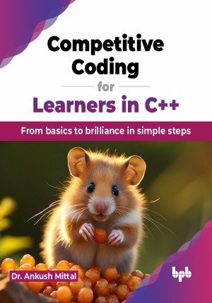

# Competitive Coding for Learners in C++

From basics to brilliance in simple steps.

This is the repository for [Competitive Coding for Learners in C++
](https://bpbonline.com/products/competitive-coding-for-learners-in-c?variant=44052664254664),published by BPB Publications.

## About the Book
C++ is a powerful language essential for logic building and competitive programming. It demands a solid grasp of data structures and algorithms to excel in coding challenges. This book is the perfect guide to help you confidently navigate this path. This book is meticulously crafted to make the fundamentals of C++ programming accessible and engaging for learners at all levels.

This book starts with basic programming concepts like variables, operators, and control flow to build a solid foundation. It then covers arrays, focusing on efficient memory management and manipulation. Loop structures, including nested loops, are also explained in detail in this book for handling iterative processes and pattern recognition. Further, Recursion is introduced for advanced problem-solving, along with optimization strategies. The book finishes with string manipulation for text processing and performance optimization techniques. In this book, you'll find exercises like output-based questions, error identification, and multiple-choice questions to test your knowledge. Each chapter also includes practical programming problems to enhance your skills. 

Take the time to absorb the concepts, tackle the challenges, and enjoy the process of crafting elegant solutions to complex problems. Let this book be your companion on your journey to becoming a proficient C++ programmer.
Happy coding!

## What You Will Learn
• Master the fundamentals of C++ programming.

• Understand and apply advanced C++ concepts.

• Develop strong problem-solving skills.

• Write efficient and error-free code.

• Debug and optimize C++ programs.

• Tackle complex programming challenges.
